# Insurance Management System

<p align="center">
  
  
  
  
  
  
</p>

<p align="center">
  <b>End-to-end insurance operations platform</b> for catalog management, policy origination,<br>
  underwriting-style approval workflows, customer self-service, and support ticketing.
</p>

<p align="center">
  <a href="#1-executive-summary">Overview</a> ·
  <a href="#3-high-level-design-hld">HLD</a> ·
  <a href="#4-c4-architecture">C4</a> ·
  <a href="#5-low-level-design-lld">LLD</a> ·
  <a href="#6-domain-model--er-diagram">ER</a> ·
  <a href="#7-runtime-sequences">Sequences</a> ·
  <a href="#14-getting-started">Run locally</a>
</p>

---

## Table of contents

1. [Executive summary](#1-executive-summary)
2. [Problem space and product scope](#2-problem-space-and-product-scope)
3. [High-level design (HLD)](#3-high-level-design-hld)
4. [C4 architecture](#4-c4-architecture)
5. [Low-level design (LLD)](#5-low-level-design-lld)
6. [Domain model / ER diagram](#6-domain-model--er-diagram)
7. [Runtime sequences](#7-runtime-sequences)
8. [Identity, access, and session design](#8-identity-access-and-session-design)
9. [Module map and bounded contexts](#9-module-map-and-bounded-contexts)
10. [Request lifecycle and routing catalog](#10-request-lifecycle-and-routing-catalog)
11. [Data, persistence, and consistency](#11-data-persistence-and-consistency)
12. [Security architecture](#12-security-architecture)
13. [Deployment and operations](#13-deployment-and-operations)
14. [Getting started](#14-getting-started)
15. [Project structure](#15-project-structure)
16. [Quality gates and CI](#16-quality-gates-and-ci)
17. [Roadmap (target-state architecture)](#17-roadmap-target-state-architecture)
18. [License](#18-license)

---

## 1. Executive summary

This repository implements a **role-separated insurance management platform** on Django’s MVT stack. It is a **modular monolith**: one deployable process, two first-class bounded contexts (`insurance` operations, `customer` self-service), shared identity, and a single transactional store.

The system covers the full policy origination loop:

| Stage | Actor | Outcome |
| --- | --- | --- |
| Catalog setup | Administrator | Categories and sellable policies exist |
| Acquisition | Customer | Account + profile created |
| Origination | Customer | Application record created in `Pending` |
| Decisioning | Administrator | Application moves to `Approved` or `Disapproved` |
| Servicing | Customer + Admin | History, dashboards, Q&A thread |

The current runtime is intentionally compact (Django + SQLite) so the **domain, workflows, and module boundaries** stay easy to reason about. The HLD below is written the same way a larger insurance core would be described: layers, contexts, state machines, and trust boundaries.

---

## 2. Problem space and product scope

### 2.1 Business problem

Retail insurance operations usually split across four desks that still share one source of truth:

1. **Product** — what can be sold (category, sum assured, premium, tenure)
2. **Distribution** — who the customer is
3. **Underwriting / ops** — whether an application is accepted
4. **Servicing** — status, history, and human support

Without a single platform, those desks drift: duplicate customer records, policies with no owner, and no audit of approve/reject.

### 2.2 In-scope capabilities

- Public landing, contact, and role-aware entry points
- Customer registration, session login, and profile (including optional photo)
- Admin session login and operational dashboards
- Category CRUD (product taxonomy)
- Policy CRUD (product catalog)
- Policy application + status workflow
- Admin queues: all / waiting / approved / disapproved holders
- Customer-initiated questions and admin replies
- SMTP contact-us channel (configured in settings)

### 2.3 Explicit non-goals (current release)

These are **called out on purpose** so the design stays honest:

- No premium billing / payment capture
- No actuarial pricing engine
- No document vault or KYC vendor integration
- No multi-tenant insurer hierarchy
- No async message bus in the live runtime

They appear again in the [target-state architecture](#17-roadmap-target-state-architecture).

---

## 3. High-level design (HLD)

### 3.1 Architectural style

```text
Style          Modular monolith (MVT)
Decomposition  Bounded contexts inside one Django project
Integration    In-process function calls + ORM
Consistency    Single-database transactions
UI             Server-rendered HTML (Bootstrap)
Identity       Django auth + group-based RBAC
```

A modular monolith is the right first architecture here: one unit of deploy, two units of design. Contexts can be extracted later without rewriting the domain.

### 3.2 Logical layers

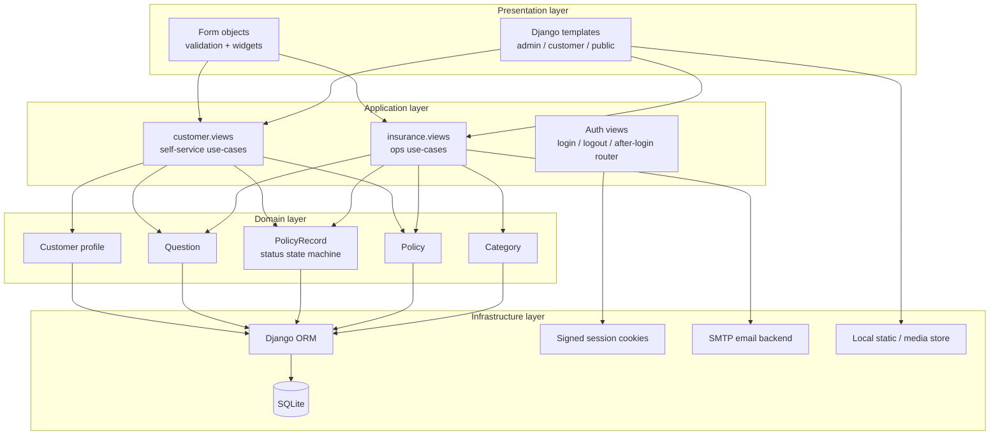

### 3.3 System qualities

| Quality | How it is achieved |
| --- | --- |
| Isolation of roles | Post-login router (`afterlogin`) sends customers and admins to different dashboards |
| Workflow integrity | `PolicyRecord.status` is the system of record (`Pending` → `Approved` / `Disapproved`) |
| Referential integrity | Foreign keys from applications and questions back to `Customer` and `Policy` |
| Input safety | Django forms + CSRF middleware |
| Observability (dev) | Request/response logs from the development server; CI runs `manage.py check` |
| Replaceability | Persistence is behind the ORM — SQLite can be swapped for PostgreSQL without changing views |

### 3.4 Policy lifecycle (business state machine)

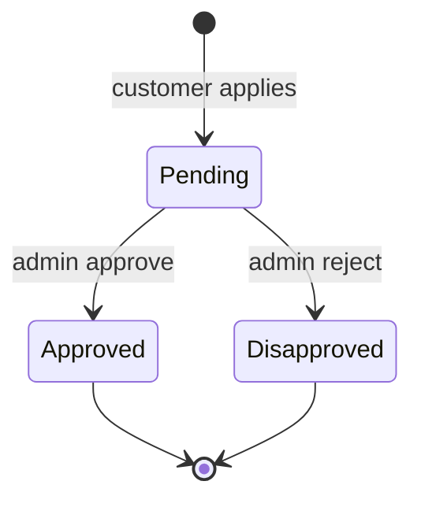

This is the **core domain invariant**. Dashboards are projections over the same table:

- Waiting queue → `status = Pending`
- Approved holders → `status = Approved`
- Disapproved holders → `status = Disapproved`
- Applied count → all rows for that customer

---

## 4. C4 architecture

### 4.1 Level 1 — System context

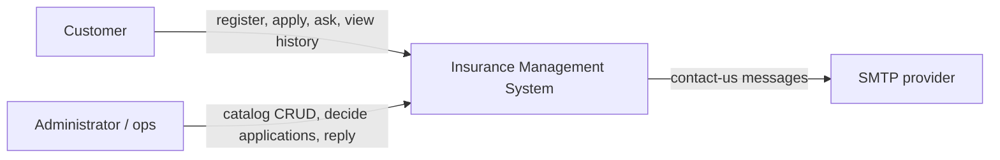

**Trust boundary:** browsers are untrusted. Only a valid session plus role checks authorize mutations.

### 4.2 Level 2 — Containers

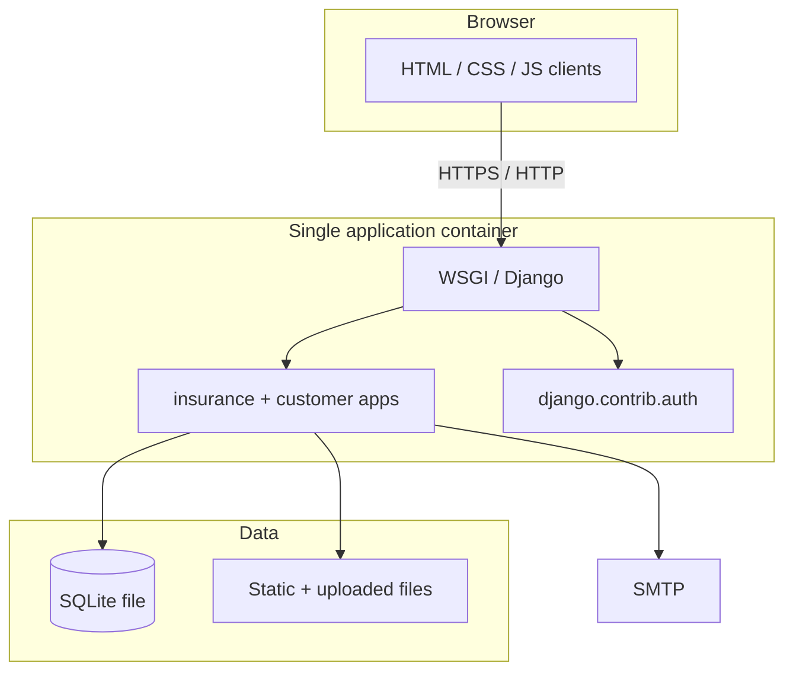

One process, one database, one file root. That is the **current container view**. The target-state view (web / worker / managed DB / object storage) is in section 17.

### 4.3 Level 3 — Components

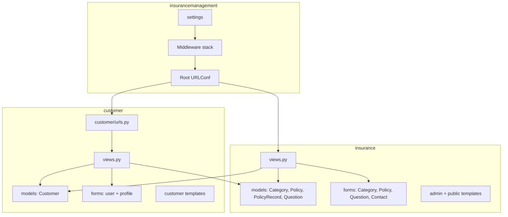

---

## 5. Low-level design (LLD)

### 5.1 Class-level domain

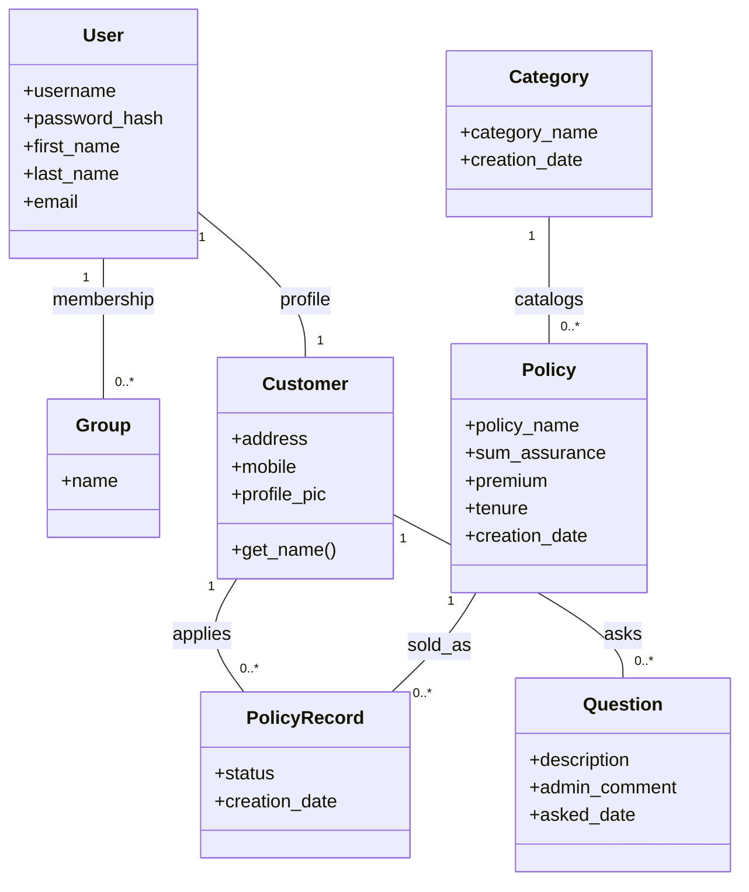

`User` is Django’s built-in identity entity. `Customer` is an **extension profile** (one-to-one), which keeps authentication concerns out of insurance domain tables.

### 5.2 Use-case → view map

| Use case | Entry | Primary objects | Side effects |
| --- | --- | --- | --- |
| Register customer | `customer_signup_view` | `User`, `Customer`, `Group(CUSTOMER)` | Password hashed, group assigned |
| Route after login | `afterlogin_view` | `User.groups` | Redirect admin vs customer |
| Apply for policy | `apply_view` | `PolicyRecord(status=Pending)` | Insert application |
| Approve / reject | `approve_request_view` / `disapprove_request_view` | `PolicyRecord` | Status transition |
| Ask question | `ask_question_view` | `Question` | Insert ticket |
| Reply to question | `update_question_view` | `Question.admin_comment` | Update ticket |
| Contact ops | `contactus_view` | `ContactusForm` | SMTP send |

### 5.3 Application write path (LLD)

```text
HTTP POST
  → CSRF middleware
    → URLConf
      → View
        → Form.is_valid()          # syntactic + field validation
          → Domain mutation        # ORM save / status change
            → Transaction commit   # SQLite lock + commit
              → Redirect (PRG)     # Post/Redirect/Get
```

Reads are symmetric: view loads a queryset, template renders a table or dashboard KPI.

### 5.4 Decisioning rules (current)

The approval path is **manual ops**, not automated underwriting:

1. Customer can apply to any `Policy` row that exists.
2. Each apply creates a new `PolicyRecord` defaulting to `Pending`.
3. Admin is the only actor that mutates `status`.
4. There is no automatic premium debit or coverage start date — coverage is represented by the approved record itself.

That keeps the LLD small and auditable: **one table, three statuses, two actors**.

### 5.5 Dashboard KPIs (derived, not stored)

Admin KPIs are live aggregations, not cached facts:

- total customers, policies, categories, questions
- total / approved / disapproved / waiting policy holders

Customer KPIs:

- available policies, own applications, category count, own questions

This is a **CQRS-lite** pattern: same write model, read models computed in the view.

---

## 6. Domain model / ER diagram

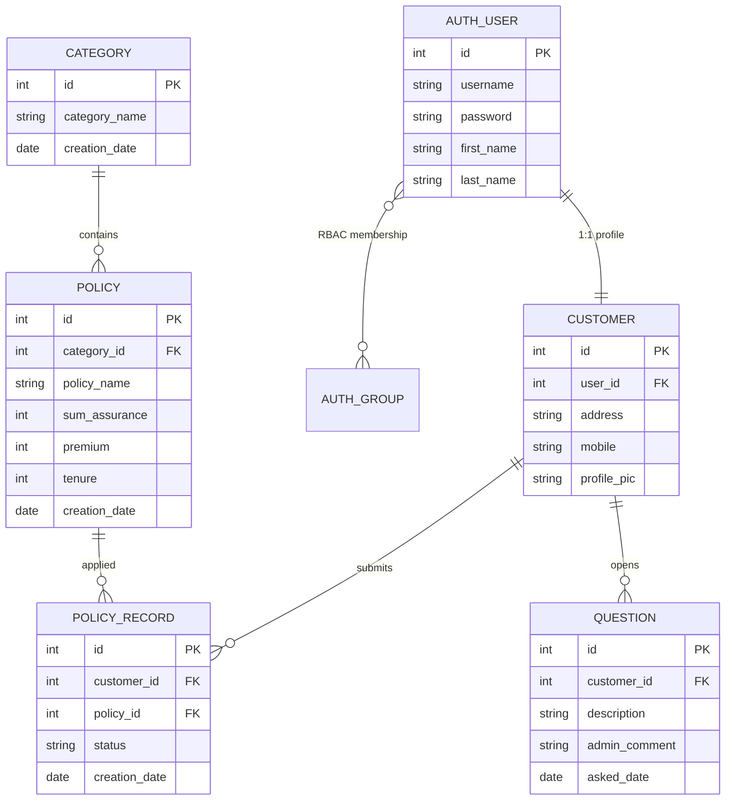

**Cardinality notes**

- A user is either a customer (group `CUSTOMER`) or an operator (no customer group → admin dashboard).
- A policy belongs to exactly one category.
- A customer may hold many applications, including multiple statuses over time.

---

## 7. Runtime sequences

### 7.1 Customer registration and first session

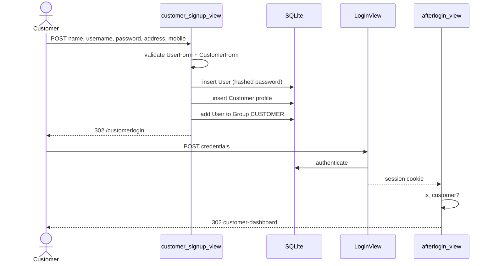

### 7.2 Policy origination and ops decision

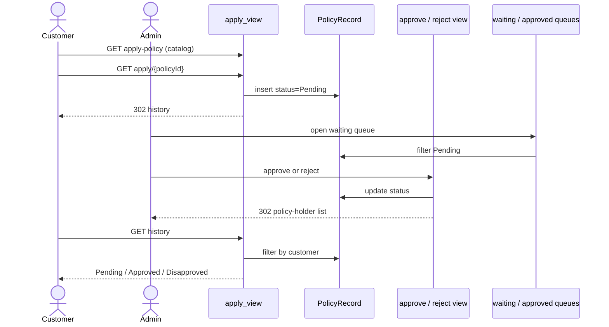

### 7.3 Support Q&A

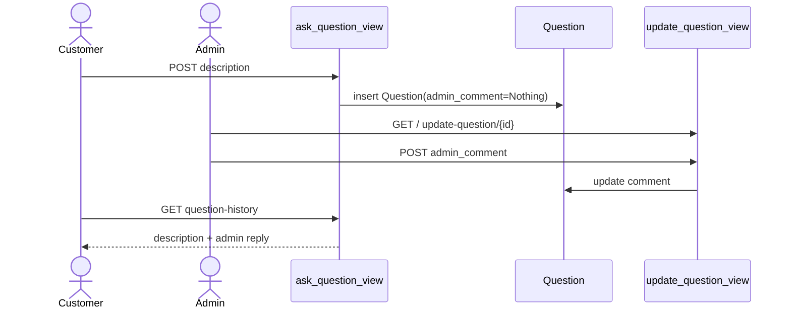

---

## 8. Identity, access, and session design

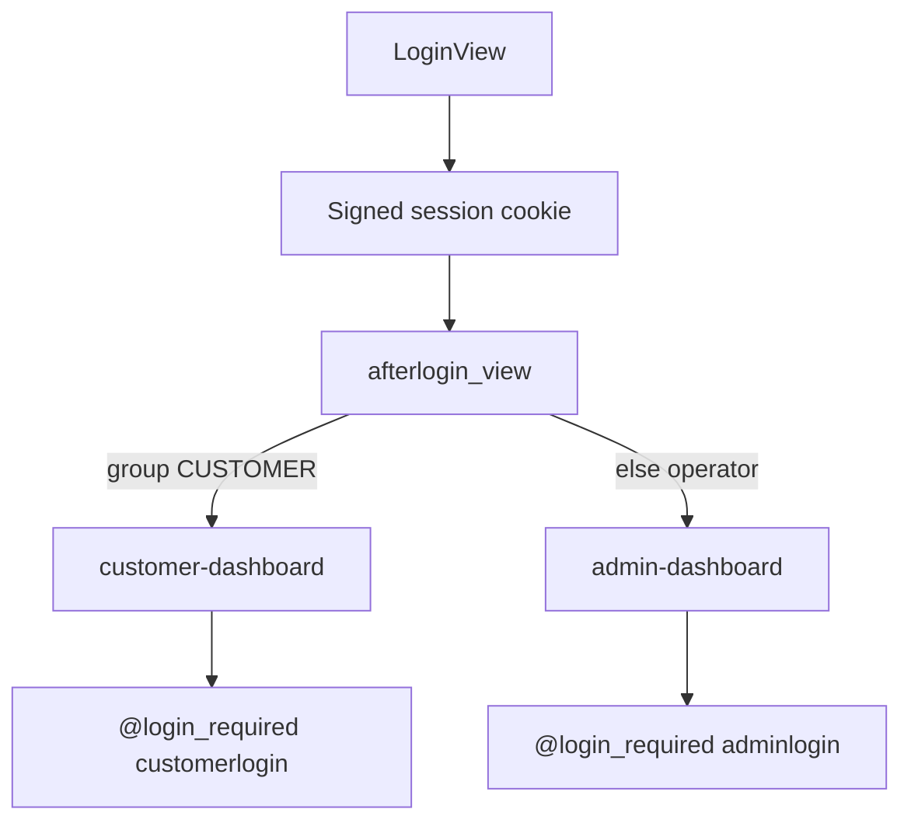

| Control | Implementation |
| --- | --- |
| Authentication | `django.contrib.auth` username/password |
| Password at rest | hasher via `User.set_password` |
| Session | server-side session, client cookie |
| Authorization | group `CUSTOMER` vs operator fallback |
| Login URLs | `/customer/customerlogin`, `/adminlogin` |
| Logout | `/logout` → logout template |

Operators are **not** required to be Django superusers for the custom admin UI. The custom `/admin-*` surface is the operational console; `/admin/` remains Django’s built-in admin.

---

## 9. Module map and bounded contexts

```text
insurancemanagement/     # composition root: settings, URLs, WSGI/ASGI
insurance/               # ops bounded context (catalog, decisioning, support reply)
customer/                # acquisition + self-service bounded context
templates/               # presentation artifacts, split by actor
static/                  # brand assets and uploaded profile images
```

| Context | Owns | Must not own |
| --- | --- | --- |
| `customer` | signup, profile, apply, own history, ask | category/policy master data, approve/reject |
| `insurance` | categories, policies, queues, replies, contact | customer password hashing (delegated to `User`) |
| composition root | middleware, DB, templates dirs, email | business rules |

Cross-context reads are allowed (customer views import `insurance.models` for catalog). Cross-context **writes of ops decisions** stay in `insurance`.

---

## 10. Request lifecycle and routing catalog

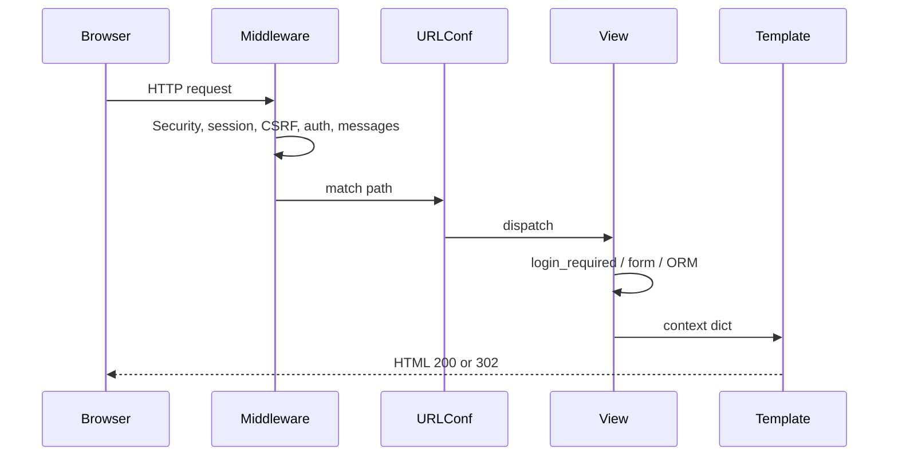

### Public

| Method | Path | Purpose |
| --- | --- | --- |
| GET | `/` | Landing; redirects if already authenticated |
| GET | `/aboutus` | About |
| GET/POST | `/contactus` | SMTP contact form |
| GET | `/logout` | End session |

### Customer

| Method | Path | Purpose |
| --- | --- | --- |
| GET | `/customer/customerclick` | Customer entry |
| GET/POST | `/customer/customersignup` | Registration |
| GET/POST | `/customer/customerlogin` | Session login |
| GET | `/customer/customer-dashboard` | KPIs |
| GET | `/customer/apply-policy` | Catalog |
| GET | `/customer/apply/<id>` | Create `PolicyRecord` |
| GET | `/customer/history` | Own applications |
| GET/POST | `/customer/ask-question` | New question |
| GET | `/customer/question-history` | Own Q&A |

### Operations

| Method | Path | Purpose |
| --- | --- | --- |
| GET/POST | `/adminlogin` | Operator login |
| GET | `/admin-dashboard` | Ops KPIs |
| GET | `/admin-view-customer` | Customer directory |
| GET/POST | `/update-customer/<id>` | Edit customer |
| GET | `/delete-customer/<id>` | Remove customer + user |
| GET | `/admin-category` | Category hub |
| GET/POST | `/admin-add-category` | Create category |
| GET | `/admin-view-category` | List |
| GET/POST | `/update-category/<id>` | Edit |
| GET | `/delete-category/<id>` | Delete |
| GET | `/admin-policy` | Policy hub |
| GET/POST | `/admin-add-policy` | Create policy |
| GET | `/admin-view-policy` | List |
| GET/POST | `/update-policy/<id>` | Edit |
| GET | `/delete-policy/<id>` | Delete |
| GET | `/admin-view-policy-holder` | All applications |
| GET | `/admin-view-waiting-policy-holder` | Pending queue |
| GET | `/admin-view-approved-policy-holder` | Approved set |
| GET | `/admin-view-disapproved-policy-holder` | Rejected set |
| GET | `/approve-request/<id>` | Transition → Approved |
| GET | `/reject-request/<id>` | Transition → Disapproved |
| GET | `/admin-question` | Support inbox |
| GET/POST | `/update-question/<id>` | Reply |

---

## 11. Data, persistence, and consistency

| Concern | Choice |
| --- | --- |
| Engine | SQLite via `django.db.backends.sqlite3` |
| Access | Django ORM only (no raw SQL in views) |
| Migrations | App migrations under `insurance/migrations` and `customer/migrations` |
| Uploads | `ImageField` → `static/profile_pic/Customer/` |
| Email | SMTP (`EMAIL_*` in settings) |

**Consistency model:** single-node, synchronous commits. Approval is a single-row update; there is no distributed saga because catalog, application, and identity share one database.

**Why this is enough for the current scale:** ops traffic is CRUD + queue scans. SQLite handles that on a single instance. PostgreSQL becomes the right move when you add concurrent writers, reporting replicas, or multiple app nodes (see roadmap).

---

## 12. Security architecture

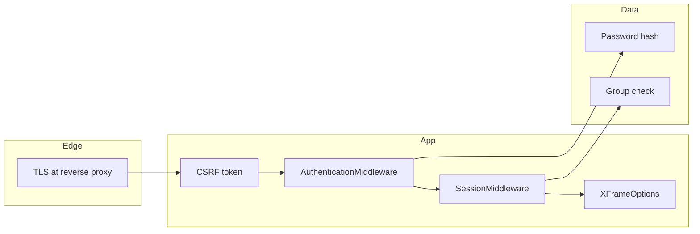

| Control | Status in this codebase |
| --- | --- |
| CSRF on POSTs | Enabled (`CsrfViewMiddleware`) |
| Clickjacking header | Enabled |
| Password hashing | Django default hasher |
| Role separation | Group `CUSTOMER` vs operator |
| Login gates | `@login_required` on dashboards and customer writes |
| Secret key / SMTP password | Settings module — replace before any public deploy |
| DEBUG | `True` for local only; must be `False` in production |

Treat `SECRET_KEY` and mailbox credentials as secrets. Do not commit a production `.env`.

---

## 13. Deployment and operations

### 13.1 Local (current)

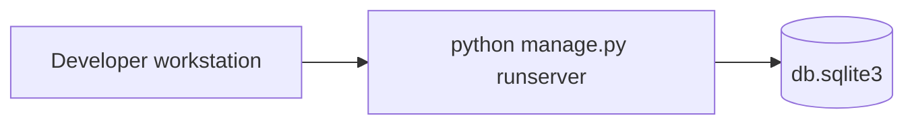

### 13.2 Production-shaped topology (recommended)

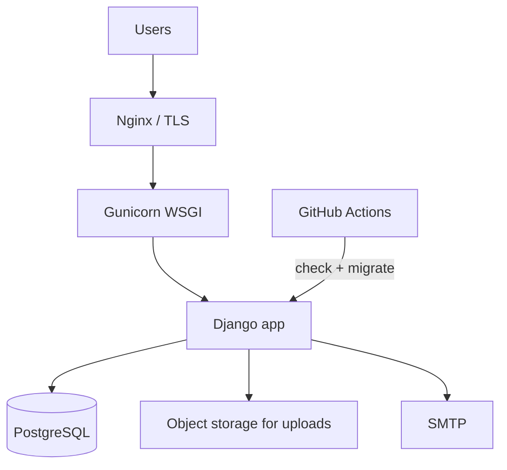

The CI workflow in `.github/workflows/ci.yml` already runs `manage.py check` and `migrate` on Python 3.10 for every push to `main`.

---

## 14. Getting started

### Prerequisites

- Python **3.10**
- `pip`
- Git

Python 3.12 is not a target for this Django 3.0.x tree.

### Setup

```bash
git clone https://github.com/Divyanshu0230/insurance-management-.git
cd insurance-management-

python3.10 -m venv venv
source venv/bin/activate          # Windows: venv\Scripts\activate

pip install -r requirements.txt
python manage.py migrate
python manage.py createsuperuser
python manage.py runserver
```

Open [http://127.0.0.1:8000/](http://127.0.0.1:8000/).

| Role | How to enter |
| --- | --- |
| Customer | Homepage → Sign Up, then Customer login |
| Admin | Navbar → Admin (`/adminlogin`) with the superuser you created |

### Typical first-run path

1. Admin adds a category (Life / Health / Vehicle).
2. Admin adds policies under those categories.
3. Customer registers and applies.
4. Admin opens the waiting queue and approves or rejects.
5. Customer reads status under History and can ask a question.

---

## 15. Project structure

```text
insurance_management/
├── insurancemanagement/     composition root
│   ├── settings.py          config, middleware, templates, DB, email
│   ├── urls.py              HTTP surface / routing catalog
│   ├── wsgi.py              production WSGI entry
│   └── asgi.py              ASGI entry
├── insurance/               ops bounded context
│   ├── models.py            Category, Policy, PolicyRecord, Question
│   ├── views.py             dashboards, CRUD, decisioning, contact
│   ├── forms.py             Category, Policy, Question, Contact
│   └── migrations/
├── customer/                self-service bounded context
│   ├── models.py            Customer profile
│   ├── views.py             signup, apply, history, Q&A
│   ├── forms.py             User + profile forms
│   ├── urls.py              customer route table
│   └── migrations/
├── templates/
│   ├── insurance/           public + admin UI
│   └── customer/            customer UI
├── static/                  images and uploads
├── .github/workflows/ci.yml quality gate
├── manage.py
├── requirements.txt
└── LICENSE
```

---

## 16. Quality gates and CI

| Gate | Command / workflow |
| --- | --- |
| Dependency install | `pip install -r requirements.txt` |
| Django system check | `python manage.py check` |
| Schema | `python manage.py migrate` |
| Automated | GitHub Actions on `push` / `pull_request` to `main` |

---

## 17. Roadmap (target-state architecture)

The live system is a modular monolith. The next evolutionary steps, in order, would be:

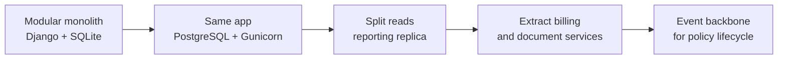

| Horizon | Change | Why |
| --- | --- | --- |
| H1 | PostgreSQL + env-based secrets + `DEBUG=False` | Production hygiene |
| H1 | Object storage for profile images | Multi-instance safe uploads |
| H2 | Automated tests around status transitions | Protect the domain invariant |
| H2 | Idempotent apply (unique customer+policy) | Stop duplicate pending rows |
| H3 | Payments context | Bind approval to premium collection |
| H3 | Document / KYC context | Underwriting evidence |
| H4 | Domain events (`PolicyApplied`, `PolicyApproved`) | Feed notifications and analytics without coupling |

Until those land, **the diagrams in sections 3–8 are the system of record for how this codebase actually runs.**

---

## 18. License

MIT. See [LICENSE](LICENSE).
